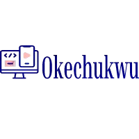
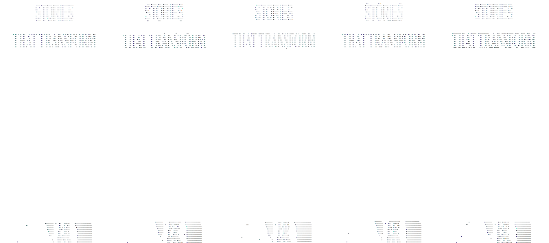

# Okechukwu Portfolio

[](https://app.netlify.com/sites/your-site-name/deploys)
[](https://github.com/Chukwu12/okey-portfolio)
[](https://your-live-site-link)

<p align="center">
  
</p>

## 👋 About Me

Hi! I'm Okechukwu, a passionate Front End Web & Mobile Developer. I specialize in crafting engaging and responsive user experiences, building everything from e-commerce sites to AI-powered apps. I love turning ideas into clean, accessible products that solve real problems.

- 🌐 [LinkedIn](https://www.linkedin.com/in/okechukwuegeruoh/)
- 💻 [GitHub](https://github.com/Chukwu12)
- ✉️ oegeruoh@email.com

---

## 🚀 Tech Stack


---

## 📂 Featured Projects

### 🟣 [Creator Brand Website](https://destinymccoy.netlify.app)
A conversion-focused brand website to communicate the creator's mission, highlight services, and present pricing packages.

### 🟢 [Creator Production Platform](https://mansaleafproduction.netlify.app)
A full-stack creator platform and marketing site to showcase portfolio work and promote digital products.

### 🍰 [Sweet ByB Website](https://sweetsbyb.netlify.app/)
E-commerce dessert website for streamlined ordering and a clean browsing experience.

### 🤖 [AI Fitness App](https://github.com/Chukwu12/FitnessApp)
Cross-platform fitness app that generates personalized workout plans using OpenAI API.

### ☀️ [Weather App](https://oniceweatherapp.netlify.app/)
React-based weather app powered by OpenWeatherMap API for real-time forecasts.

### 🍲 [Recipe App](https://onice-recipeapp.up.railway.app/)
Recipe discovery app for exploring, filtering, and managing meals across cuisines.

### 🪙 [Coin-Flip](https://naija-coinflip.netlify.app/)
Backend-powered coin flip game with instant, fair results.

### 🏀 [Basketball Teams](https://basketball-team-express.onrender.com)
Web app to browse NBA team data with a lightweight Express backend.

### 🟦 [Pokédex (React)](https://onicepokedex.netlify.app/)
Modern Pokédex web app built with React, featuring search, filter, and detailed Pokémon stats.

### 💇‍♀️ [Amour Hairstyle Studio](https://amourhairstyles.netlify.app/)
Responsive multi-page salon website with service pages, pricing, and booking details.

---

## 📸 Screenshots

<p align="center">
  
  
  
</p>

---

## 🛠️ Getting Started

1. Clone the repo:
   ```bash
   git clone https://github.com/Chukwu12/okey-portfolio.git
   ```
2. Open the folder in VS Code or your favorite editor.
3. Open `index.html` in your browser or use a local server extension.

---

## 📄 License

This project is open source and available under the [MIT License](LICENSE).

---

<p align="center">
  <b>Made with ❤️ by Okechukwu</b>
</p>
